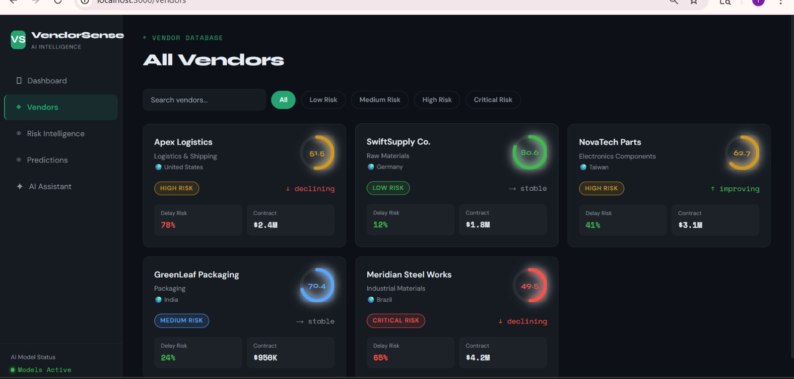
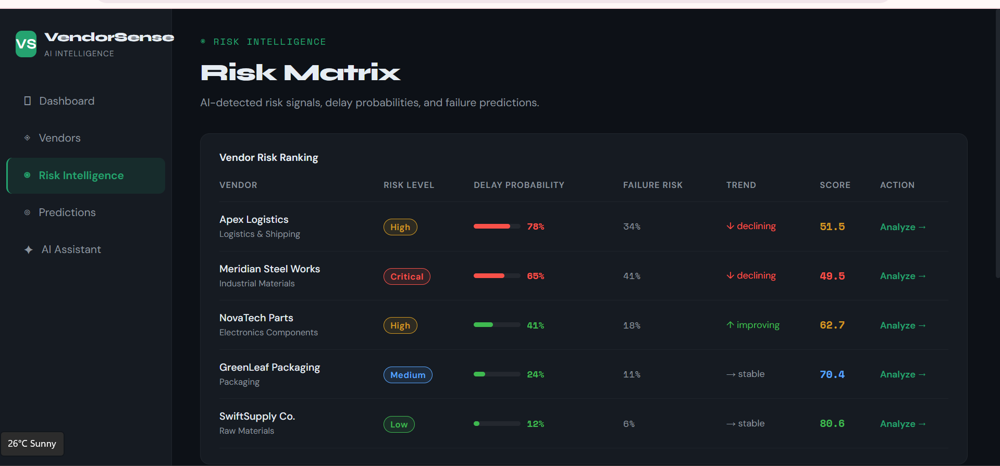
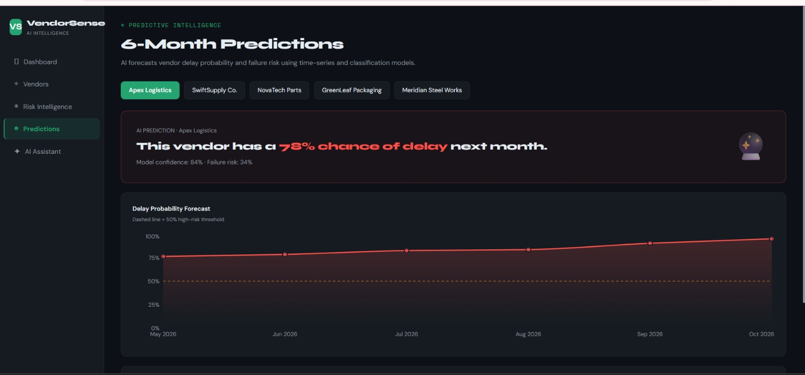

# 🧠 VendorSense – AI-Powered Smart Vendor Intelligence System

A full-stack hackathon project featuring AI vendor scoring, predictive risk detection, explainability, and an AI assistant.

## Tech Stack

| Layer | Tech |
|-------|------|
| Frontend | Next.js 14 + TypeScript + Tailwind CSS |
| Backend | Python FastAPI |
| AI/ML | scikit-learn, pandas, numpy |
| Charts | Recharts |

## Project Structure

```
vendorsense/
├── frontend/          # Next.js app
│   └── src/
│       ├── app/       # Pages (dashboard, vendors, risk, predict, assistant)
│       ├── components/# Reusable UI components
│       └── lib/       # API utils
└── backend/           # FastAPI server
    └── main.py        # All routes + AI logic
```

## Features

- **AI Vendor Scoring Engine** — ML-weighted scores across cost, delivery, quality, performance
- **Predictive Risk Detection** — 6-month delay probability forecasting per vendor
- **Explainable AI** — Every score broken down by contributing factor
- **External Signal Integration** — News sentiment, weather risk, market volatility
- **Decision Recommendations** — AI tells you exactly what action to take
- **AI Chat Assistant** — Conversational interface with vendor-specific context

## Quick Start

### 1. Start Backend
```bash
cd backend
python -m venv venv
source venv/bin/activate     # Windows: venv\Scripts\activate
pip install -r requirements.txt
uvicorn main:app --reload --port 8000
```

Backend runs at: http://localhost:8000  
API docs at: http://localhost:8000/docs

### 2. Start Frontend
```bash
cd frontend
npm install
npm run dev
```

Frontend runs at: http://localhost:3000

## Pages

| Route | Description |
|-------|-------------|
| `/` | Main dashboard — stats, alerts, leaderboard |
| `/vendors` | All vendors with filtering |
| `/vendors/[id]` | Deep vendor analysis with 3 tabs |
| `/risk` | Risk matrix and bubble chart |
| `/predict` | 6-month delay forecast per vendor |
| `/assistant` | AI chat with explainability |

## Demo Vendors

- **Apex Logistics** (V001) — High risk, 78% delay probability
- **SwiftSupply Co.** (V002) — Top performer, low risk
- **NovaTech Parts** (V003) — Medium risk, improving trend
- **GreenLeaf Packaging** (V004) — Stable, low-medium risk
- **Meridian Steel Works** (V005) — Critical risk, multiple incidents




